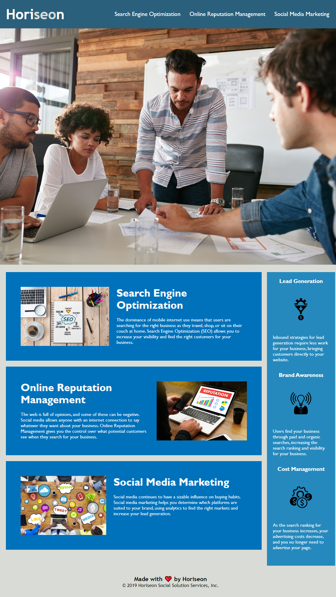

# Horiseon Refactor Project

## Description 

This repository includes all of the assets and code necessary for updating Horiseon's website to ensure:

1. Accessibility is addressed throughout it
2. A semantics-first approach is followed in the code 
3. The code is optimised and follows a logical structure

## Installation

In order for these changes to be implemented in the live version of Horiseon's website, the existing files will need to be replaced with the provided ones. During this process, all necessary steps to ensure links are correct need to be taken.

## Mock-Up

The updated code does not affect the application visually:

## Credits

A solution to adding ALT text to a background image was found through research on:
[stackoverflow.com](https://stackoverflow.com/questions/4216035/css-background-image-alt-attribute)
[MDN](https://developer.mozilla.org/en-US/docs/Web/Accessibility)
[Claude.ai](https://claude.ai/)

## License

MIT License

Copyright (c) 2023 Lxpap

Permission is hereby granted, free of charge, to any person obtaining a copy
of this software and associated documentation files (the "Software"), to deal
in the Software without restriction, including without limitation the rights
to use, copy, modify, merge, publish, distribute, sublicense, and/or sell
copies of the Software, and to permit persons to whom the Software is
furnished to do so, subject to the following conditions:

The above copyright notice and this permission notice shall be included in all
copies or substantial portions of the Software.

THE SOFTWARE IS PROVIDED "AS IS", WITHOUT WARRANTY OF ANY KIND, EXPRESS OR
IMPLIED, INCLUDING BUT NOT LIMITED TO THE WARRANTIES OF MERCHANTABILITY,
FITNESS FOR A PARTICULAR PURPOSE AND NONINFRINGEMENT. IN NO EVENT SHALL THE
AUTHORS OR COPYRIGHT HOLDERS BE LIABLE FOR ANY CLAIM, DAMAGES OR OTHER
LIABILITY, WHETHER IN AN ACTION OF CONTRACT, TORT OR OTHERWISE, ARISING FROM,
OUT OF OR IN CONNECTION WITH THE SOFTWARE OR THE USE OR OTHER DEALINGS IN THE
SOFTWARE.
